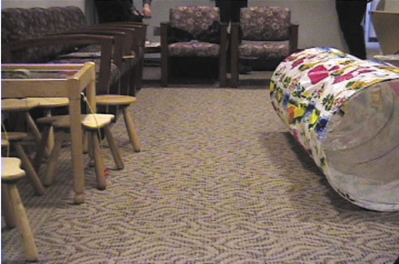
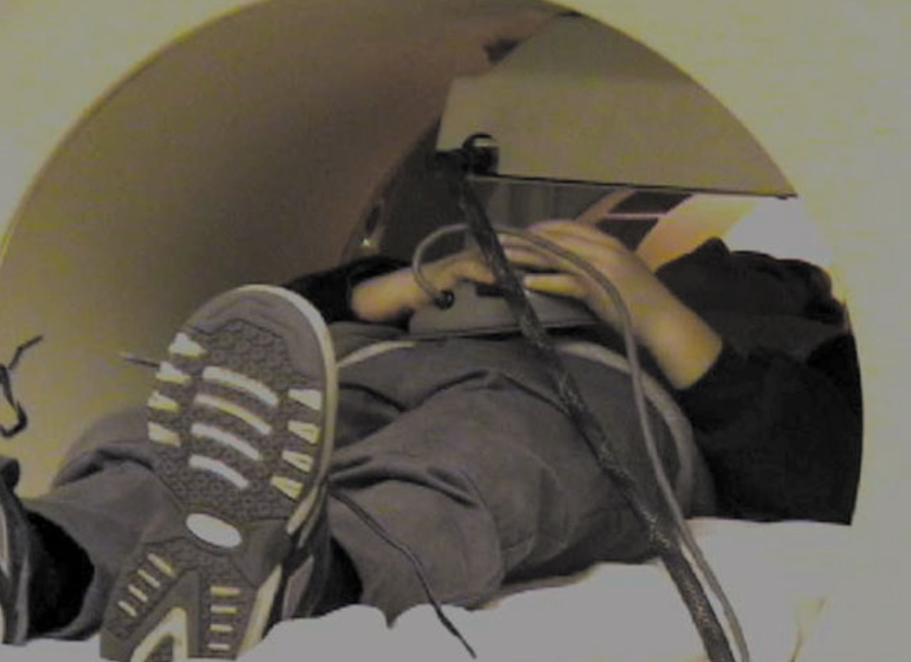
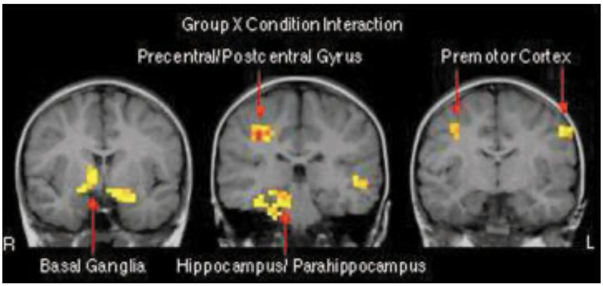

Davidson, M. C., Thomas, K. M., & Casey, B. J. (2003). Imaging the developing brain with fMRI. Mental Retardation and Developmental Disabilities Research Reviews, 9(3), 161–167. [https://doi.org/10.1002/mrdd.10076](https://doi.org/10.1002/mrdd.10076)

# Figure 1

## Simulation

Q. What is the purpose of the presimulator tunnel?

A. TODO

## Hardware

Q. What is device the child hoding in his/her hands? What is the purpose of the device?

A. TODO

# Figure 2

## Perspective

Q. From which perspective are we viewing the brain (i.e., top, bottom, left, right front, or back)?

A. TODO

## Spatial Relationships

Q. There are three images of brains. How are they spatially related?

A. TODO

## Alternate Universe

Q. The figure higlight the brain regions showing a robust MR signal change for __the interaction of group (children, adults) by condition (incompatible, compatible)__. Suppose in the alternate universe, the authors did not discover any signifiant interaction, what would the figure look like instead?

A. TODO

## Variation 1

Suppose we were to plot a figure to instead show only interaction between groups (children vs. adults). Would we see more or fewer highlighted regions? Why?

TODO

## Variation 2

Q. Suppose we were to plot a figure to instead show interaction between groups (children vs. adults) by conditions (imcompatible, compatible) and __by income level__. Would we see more or fewer highlighted regions? Why?

A. TODO

# Figure 3

## Anatomy

Q. In the first brain image, what is the dark circle at the center bottom?

A. TODO

## Spatial Ordering

Q. What is the spatial ordering among the four images (e.g., top-down, left-right...etc)?

## Changes

Q. Why were MR signal changes reported as a percentage rather than an absolute term?

A. TODO

## Baseline

Q. What were the percentage changes relative to?

A. TODO

## Wishful Thinking

Q. Suppose we wish that the correlation can be even stronger for the inferior cortex. What would want the first plot to look different (i.e., the value of r, the patterns of dots)?

A. TODO

## Flipped Diretion

Q. The paper reports that "Similar comparisons between accuracy performance and intensity of activation revealed positive correlations in the caudate nucleus and inferior frontal cortex, __with more activation__ in these regions for subjects making a greater number of errors. (last sentence on p. 165)" Support this finding were flipped, how would the figure look differently?

A. TODO

