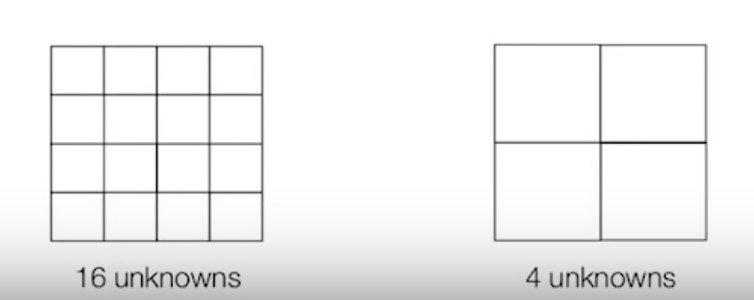

# Video

<iframe width="560" height="315" src="https://www.youtube.com/embed/PxqDjhO9FUs" frameborder="0" allow="accelerometer; autoplay; encrypted-media; gyroscope; picture-in-picture" allowfullscreen></iframe>

# Questions

## Spatial Resolution

Q. How many K-space measruments are needed to obtain a 3D image of a brain volume at a resolution of 10 by 10 by 10 voxels?

A. 10x10x10 = 1000 equations for 1000 unknowns, so we need 1000 K-space measurements

## Time Constraint

Q. If a K-space measurment takes 10ms and we want the TR to be 2000ms, give an example of the 3D resolution that is feasible (for example, 10 by 10 by 10 wouldn't be possible)?

A. Assuming the dimensions are all equal, we need to solve the equation x^3 = (2000 / 10) to find the maximum value of each dimension that can fit in this time constraint. This would give a resolution of 5x5x5.
