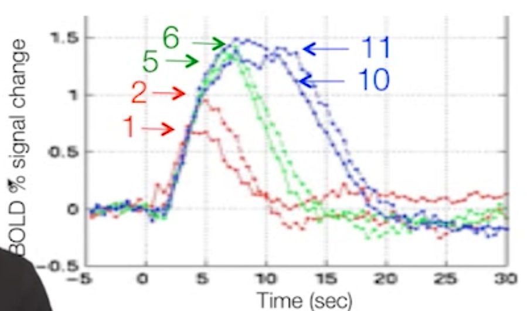

# Video

<iframe width="560" height="315" src="https://www.youtube.com/embed/jG2WQpgpnMs" frameborder="0" allow="accelerometer; autoplay; encrypted-media; gyroscope; picture-in-picture" allowfullscreen></iframe>

# Questions

## HRF

Q. Does the peak at 5 second indicate the time of the highest neural activity? If so, how? If not, why not?

A. No, the peak indicates the period of highest blood flow, which happens 4-6 seconds after the peak neural activity as the body overcompensates for the metabolic demands of the neural activity.

Q. Suppose we choose a TR of 500ms. Roughly at which frame (e.g., 5th, 10th, 15th ...etc) may we observe the peak response?

A. This would occur at roughly the 10th frame, or 5 seconds.

## Flashing Checkerboard

This graph is used to illustrate multiple issues related to nonlinearity. See if you can identify specific patterns or features in the graph that illustrate the said issues.

Q. Where in the graph can we see that there is non-linearity if two stimuli are closer than 5 seconds apart?

A. With the red lines representing a train of 1 or 2 checkerboards. The response to 2 events should be twice as high as one, but it is nowhere near that level of response.

Q. Where in the graph can we there is non-linearity if two stimuli are more than 5 seconds apart?

A. With the green lines. The response should be 3 times higher than with 1, but it is only about half of the predicted value.

Q. Where in the graph can we see the effect of saturation?

A. The blue lines, representing the trains of 10 or 11 events. The peak is no higher than the 5 or 6 example, which means the neural response has been saturated.
